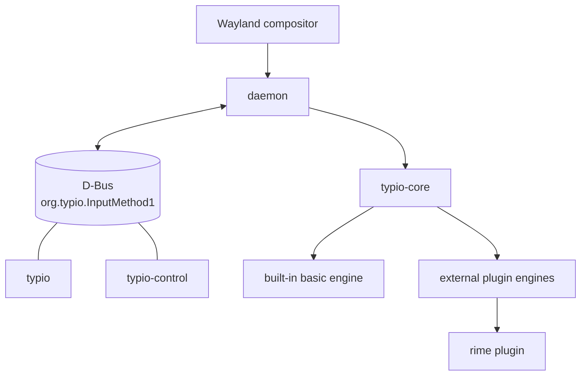

# Architecture Overview

## Overview

Typio is split into a small core library and a Wayland-facing daemon. The daemon directly implements the input-method side of the Wayland text input stack and relies on the compositor/application `text-input-v3` path for end-to-end text entry.



## Protocol Stack

Typio runs on the following protocol layers:

- `zwp_text_input_manager_v3` / `zwp_text_input_v3`
  This is the application-to-compositor text input path. It carries editing state, surrounding text, content type, and cursor rectangle information. Typio relies on this path being present in the session, but Typio is not the text-input client.
- `zwp_input_method_manager_v2` / `zwp_input_method_v2`
  This is the compositor-to-input-method path. Typio directly implements this side to receive activation, surrounding-text state, and to send preedit and commit requests back through the compositor.
- `zwp_input_method_keyboard_grab_v2`
  This gives Typio the keyboard stream it needs for composition, candidate navigation, and command handling.
- `zwp_input_popup_surface_v2`
  This is the native Wayland candidate popup path used for input method UI placement near the active text cursor.
- `wl_compositor`, `wl_surface`
  These core Wayland interfaces back the popup window. Its pixels come from a flux (Vulkan) swapchain created on the popup `wl_surface` via `vkCreateWaylandSurfaceKHR` — there is no `wl_shm` buffer. Popup scaling follows `wl_surface.enter/leave` plus per-output `wl_output.scale`.

## Source Tree

The source tree is organized by stable product boundary first:

- `core/`
  The `typio-core` Rust crate (`Cargo.toml` + `src/`) and the hand-written public C ABI headers in `include/typio/`. The crate implements the full ABI; everything else in the project links it. **No platform dependencies** — core knows nothing about Wayland, D-Bus, GTK, Vulkan, or the event loop. It is the platform-agnostic business kernel.
- `daemon/`
  The system-facing adapter layer. Owns the Wayland IME host, IPC bus, status bus, tray, and voice plumbing. Receives platform events and translates them into `core` abstractions; takes `core` callbacks and translates them back into platform requests.
- `control/`
  The GTK control panel.
- `engines/`
  Built-in and pluggable input-engine implementations.

Top-level `src/` directories sit on one axis: the reusable core library, user-facing applications, and engine implementations. The dependency direction — apps and engines both depend on core, never the reverse — is the rule the layout encodes. See [Core ↔ Apps Boundary](#core--apps-boundary) for the full contract.

## Main Components

### `typio-core`

Located under `core/`.

Responsibilities:

- instance lifecycle
- engine registration and loading
- input context state
- configuration parsing
- key and voice event structures
- shared utility code

Internal split:

- `core/include/typio/` — installed public C ABI headers (hand-written, single source of truth)
- `core/Cargo.toml` + `core/src/` — the `typio-core` Rust crate that implements the entire ABI (config, input context, engine manager, schema registry, key events, logging, string utilities)

### `daemon`

Located under `daemon/`.

Responsibilities:

- connect to the Wayland display
- bind `zwp_input_method_manager_v2`
- operate within sessions where applications and the compositor expose `zwp_text_input_manager_v3`
- bind `wl_compositor` and `wl_shm` for candidate popup rendering
- create per-activation Typio sessions
- grab keyboard input through the input-method protocol
- translate XKB keyboard state into `TypioKeyEvent`
- forward commit and preedit callbacks back into Wayland protocol requests

Within the Wayland daemon, responsibilities are intentionally split by layer:

- `wl_input_method.c` — protocol-facing text entry updates and preedit round-trip decisions
- `text_ui_backend.c` — backend boundary for Typio-managed text UI
- `candidate_popup.c` — Wayland-native popup backend over `zwp_input_popup_surface_v2`
- `candidate_popup_layout.c` — text measurement and geometry computation
- `candidate_popup_paint.c` — Flux pixel rendering
- `key_route.c` — key-routing decisions
- `wl_keyboard.c` — keyboard-grab event handling, XKB updates, emergency-exit fast path
- `wl_event_loop.c` — polling loop, Wayland dispatch, watchdog, auxiliary-fd integration
- `wl_runtime_config.c` — runtime config reload, shortcut refresh, config-watch rearming
- `wl_frontend.c` — frontend construction, registry/global binding, teardown glue

Observability ownership follows the same boundary split. See [Timing Model](timing-model.md) for detailed timing rules and [Control Surfaces](control-surfaces.md) for control-surface binding rules.

### `typio` (CLI)

Located under `cli/` (Rust). Built as the `typio` binary.

A standalone command-line client (`typio engine`, `typio status`, etc.) that interacts with the running daemon over UDS (Unix Domain Socket), with D-Bus as a fallback. `typio-daemon` forwards to the `daemon` binary.

Responsibilities:

- provide a CLI for querying and controlling a running Typio daemon
- the daemon (`typio-daemon`) is started separately
- communicate over the UDS socket (`$XDG_RUNTIME_DIR/typio/daemon.sock`)
- no dependency on `typio-core`; pure IPC client

### `typio-control`

Located under `control/`.

Responsibilities:

- provide a GTK control panel for runtime state and persistent configuration
- consume the same D-Bus surface as the `typio` client
- reuse `typio-core` config and schema helpers where shared parsing logic is preferable to duplicating it in UI code

See [D-Bus Interface Reference](../reference/dbus-interface.md) for the full protocol specification.

### Built-In `basic` Engine

Located at `engines/basic/basic.c`.

Responsibilities:

- provide a zero-dependency built-in keyboard engine
- commit printable Unicode text directly
- give the daemon a usable default engine even when no plugins are installed

## Core ↔ Apps Boundary

The single most important rule for this codebase: **core is a library, apps are hosts.** The dependency graph runs one direction.

### Dependency direction

```text
       apps ──────┐                ┌────── engines  (built-in or .so plugins)
                  ▼                ▼
                 core ◄────────────┘
```

- Apps `#include "typio/*.h"` and link `typio-core`. Core never reaches back.
- Engines link `typio-core` and are loaded at runtime by core's `engine_manager`; core does not know which engines exist at compile time.
- Core depends on **nothing platform-specific** — no Wayland, no D-Bus, no GTK, no X11, no Vulkan, no event loop, no signal handlers, no GUI toolkit. `tests/test_core.c` exercises core with zero compositor.

### What each side owns

| Concern | Owner |
|---|---|
| `TypioInstance`, `TypioInputContext`, `TypioEngine` lifecycles | core |
| Engine plugin loading and switching (`engine_manager`) | core |
| Config parsing (TOML), schema, persisted state | core |
| Key-event *types* (`TypioKeyEvent`, `TypioModifier`) and voice-engine *types* (`TypioVoiceEngineOps`) | core |
| Wayland protocol bindings, XKB state, popup Vulkan surface | apps (`daemon/wayland/`) |
| Translating `wl_keyboard` events → `TypioKeyEvent` | apps |
| Translating engine callbacks → `zwp_input_method_v2.commit_string` / preedit | apps |
| D-Bus surfaces (`org.typio.InputMethod1`), tray, GTK panel | apps |
| PipeWire capture, voice recording/transcribing state machine, voice orchestration | apps (`daemon/voice/`) |
| The main event loop, signal handlers, file descriptors | apps |

### Direction of data flow across the boundary

Calls go both ways; the dependency does not.

- **App → Core (synchronous):** `typio_instance_init`, `typio_input_context_focus_in`, `typio_input_context_process_key(ctx, &event)`, `typio_instance_reload_config`. The app translates platform events into `Typio*` structs and pushes them in.
- **Core → App (callbacks the app registered):** `composition_callback`, `commit_callback`, `engine_changed_callback`, `status_icon_changed_callback`. Composition (preedit+candidates) is one transactional value; commit is a separate ordered event ([ADR-0011](../adr/0011-composition-and-lifecycle-rewrite.md)). When an engine updates the composition, commits text, or the active engine changes, core invokes the registered callbacks. The app turns those into protocol writes, tray updates, or D-Bus signals.

The app never exposes `wl_display*` or `xkb_state*` to core. Core never calls into platform APIs. This is what keeps core unit-testable in CI without a compositor.

### Decision rule for new code

When deciding whether a file belongs in `core/` or `daemon/`:

| If the code… | …it goes in |
|---|---|
| Mentions `wl_*`, `xkb_*`, D-Bus types, `Gtk*`, `flux_*`, `pw_*` (PipeWire), file descriptors, signals, or threads | **apps** |
| Is data or state belonging to `TypioInstance`, `TypioInputContext`, engines, config, or the engine ABI | **core** |
| Is a pure state machine, but only one frontend (Wayland, voice, panel) cares about it | **apps** — keep platform-named types with their platform, even when the code is pure |

The third row is the one that catches people. *Purity* alone is not a reason to migrate to core. If no other host needs the concept (the Wayland session `reduce`/`diff` state machine, the voice service state machine, popup geometry), putting it in core just leaks platform vocabulary into a platform-agnostic library. Core's value is precisely what it *doesn't* mention.

### Worked example: voice

Voice is the cleanest illustration of the boundary working correctly:

- **In core:** `TypioEngineTypeVoice` and `TypioVoiceEngineOps` — the "PCM in, text out" engine ABI. Whisper and sherpa-onnx register as voice engines through the same `engine_manager` that loads keyboard engines.
- **In apps (`daemon/voice/`):** PipeWire capture, the recording/transcribing state machine, the pthread that runs inference, the `eventfd` that wakes the main loop when inference finishes, the daemon-side reading of voice config sections.

The reusable abstraction is already on the core side. The orchestration that drives it is platform-bound and stays in apps. A future X11 or CLI host would link the same voice engines through the same ABI, but would need its own audio capture and event-loop integration — that's exactly what "apps own platform glue" means.

### Why this asymmetry

- Core can be linked into a Wayland daemon, a future X11 daemon, a fuzzer, a CLI tool, or a unit test without change.
- Adding a new frontend or a new control surface does not require touching core.
- The dependency graph has no cycles. Callbacks transport data, not types.
- The C ABI stays narrow: a new host language (Python, Lua) can drive core through the same headers without re-implementing platform glue.

## Engine Manager Model

`TypioEngineManager` supports two engine sources:

- built-in engines registered at startup
- external shared objects loaded from the engine directory

For external engines, Typio expects exported symbols:

- `typio_engine_get_info`
- `typio_engine_create`

Each engine instance receives a config path such as:

```text
~/.config/typio/engines/<engine>.toml
```

For built-in integrations, Typio's authoritative user configuration now lives in the root file `~/.config/typio/typio.toml`, typically under sections such as `[engines.rime]` and `[engines.mozc]`.

Activation rules:

- engine instances are created lazily when an engine is selected
- switching a keyboard engine never evicts the active voice engine
- switching a voice engine never evicts the active keyboard engine
- if creating or activating the requested engine fails, the manager attempts to restore the previously active engine in the same category
- next/previous keyboard switching resolves against the ordered keyboard list, not the raw registration table

## Engine Categories

Typio models input engines in two parallel categories:

- `keyboard` — the primary input pipeline. Keyboard engines own key processing, preedit, candidate lists, commits, and status icons.
- `voice` — a secondary pipeline for speech recognition. Voice engines do not replace the active keyboard engine; they run alongside it and are selected independently.

Operational rules:

- there is exactly one active keyboard engine slot
- there is exactly one active voice engine slot
- keyboard and voice selections do not evict each other
- the tray, status bus, and control panel should treat keyboard and voice as separate runtime values, not as one flat engine list

## Runtime Scheduling

The daemon is single-process and event-loop driven. The main loop polls:

- Wayland display events
- keyboard repeat timer
- status D-Bus fd
- tray D-Bus fd
- voice completion fd
- config inotify fd
- config reload timer fd

Scheduling rules:

- Wayland dispatch remains the primary path and must not be starved by auxiliary fds
- D-Bus dispatchers process a bounded number of messages per tick
- config filesystem events are debounced before reload
- the virtual-keyboard keymap deadline can shorten the poll timeout
- voice reloads are deferred while recording or inference is active, then applied once the active job finishes

## IME / Engine Boundary

Typio is the IME host and framework layer, not a replacement for engine-owned language logic.

Authority split:

- engines own linguistic behaviour and engine-specific semantics
- Typio owns protocol hosting, UI integration, and cross-engine control surfaces

In practice, engine ownership includes:

- composition and conversion behaviour
- candidate generation, ordering, selection semantics, and paging
- engine-specific runtime state such as active schema or input mode
- any behaviour that only the upstream engine can define authoritatively

In practice, Typio ownership includes:

- Wayland input-method and popup-surface integration
- `TypioInputContext` as the transport and UI state carrier
- candidate popup rendering, tray/status export, and control-panel plumbing
- Typio-owned persisted config and runtime state publication
- converging user experience where presentation can be standardized without changing engine semantics

Design rules:

- Typio should respect the upstream engine's supported behaviour instead of reinterpreting it locally.
- Typio should prefer official engine APIs, runtime controls, and discovery paths over file-level hacks or private config rewrites.
- Typio may normalize presentation and workflow across engines, but it must not fake unsupported engine semantics just to make engines look identical.
- If an engine does not expose a supported control, preserving the engine's real behaviour is preferred over adding a Typio-side override that would contradict user expectations or upstream design intent.

## Wayland Data Flow

1. The compositor activates the input method.
2. Typio creates or resets a session.
3. Typio grabs the keyboard and builds XKB state.
4. Key presses become `TypioKeyEvent`.
5. The active engine returns one of: not handled, handled internally, composing, committed.
6. Composition and commit callbacks are translated into `zwp_input_method_v2` requests (the composition's preedit via `set_preedit_string`, commit via `commit_string`).
7. The composition's candidate list is rendered through `zwp_input_popup_surface_v2` when the session exposes the necessary Wayland globals. If candidate popup rendering is unavailable, Typio keeps candidate state visible inline in preedit.

## Candidate Popup Pipeline

The candidate-list UI is intentionally layered so state and rendering stay separate:

1. the keyboard engine owns candidate content and the selected index
2. `TypioInputContext` stores the composition (preedit + candidates) as the UI source of truth
3. the composition callback marks the popup dirty; the event-loop flush refreshes it once per iteration, diffing against the last composition sent
4. `text_ui_backend.c` provides the Typio-side UI backend boundary
5. `candidate_popup.c` classifies the change and dispatches to the correct render path over `zwp_input_popup_surface_v2`

The important architectural rule is that the refresh path depends on the text-UI backend abstraction, not on a concrete popup implementation.

### Delta classification

Every update is first classified into one of five `PopupDelta` values before any rendering work begins:

| Delta | Trigger | Action |
|-------|---------|--------|
| `NONE` | Nothing visible changed | Skip rendering |
| `SELECTION` | Only selected index changed | Full repaint (fast on persistent surface) |
| `AUX` | Only preedit / mode label changed (same popup size) | Full repaint (fast on persistent surface) |
| `CONTENT` | Candidate list changed (page navigation) | Full repaint |
| `STYLE` | Font, theme, or output scale changed | Cache invalidation + full repaint |

Classification is a pure comparison of the incoming state against the cached `PopupGeometry` snapshot and costs no rendering work.

### Geometry and layout cache

`PopupGeometry` is an immutable snapshot of all computed candidate positions and auxiliary text positions for one page. The selected index is **not** part of the geometry; changing the selection never requires re-measuring text or recomputing positions.

Text measurement and `TypioTextLayout` objects are owned by `PopupRenderCtx`, a persistent per-popup structure holding a 128-entry LRU cache. Cache entries are keyed by `FNV-1a(formatted_text + font_desc + color)`. Layouts are shaped through HarfBuzz; at paint time each shaped glyph's FreeType outline is decomposed into a `flux_path` and filled on the GPU canvas (no glyph bitmaps, resolution-independent).

### Paint paths

`candidate_popup_paint.c` records the popup into a flux canvas: the background is the canvas clear colour, the border / selection highlight / mode divider are solid `flux_canvas_fill_rect` calls, and text is filled glyph outlines (`typio_flux_fill_layout`).

The popup coordinator (`candidate_popup.cc`) owns the GPU frame lifecycle. It creates a flux (Vulkan) **swapchain** directly on the input-popup `wl_surface` (`vkCreateWaylandSurfaceKHR` → `flux_surface_create` → `flux_canvas_create`), and per update runs `flux_surface_begin_frame` → `flux_canvas_begin(clear)` → record → `flux_canvas_end` → `flux_frame_submit` → `flux_frame_present`. The swapchain is resized with `flux_surface_resize` when the popup size changes. Because the swapchain owns frame pacing and buffering, there is no SHM buffer pool and no manual frame-callback throttle.

The present runs synchronously on the event-loop thread, so `flux_surface_begin_frame` uses a **bounded timeout**: a compositor that stops releasing swapchain images (display asleep / surface occluded after a lock or suspend) makes the present time out and skip rather than block the loop, and repeated stalls recreate the swapchain to recover after resume. This is what keeps the present from stalling the event loop — see [ADR-0006](../adr/0006-resilient-candidate-popup-present.md).

## Keyboard Safety Model

The Wayland keyboard grab path stamps every key with the current grab **epoch** and tracks forwarded keys for symmetric release in `key_tracker.{c,h}`. A key whose epoch ≠ the current grab epoch is dropped at routing — the single fence for stale keys (re-sends across rebuild, suspend, or reconnect). Grab build/teardown, including the brief modifier carry across a focus handoff, is part of `session_effects` `apply`, not a separate boundary module.

The intended forwarding model is conservative: if the IME does not consume a key, Typio forwards the original press/release sequence and separately keeps the virtual keyboard modifier state in sync. Modifier changes must not trigger synthetic releases for unrelated non-modifier keys in the main key path.

The rules for this path live in the [Timing Model](timing-model.md) and [ADR-0011](../adr/0011-composition-and-lifecycle-rewrite.md). Any change to grab lifecycle or epoch fencing should update those alongside the code.

## Current Scope

Implemented:

- Wayland input method frontend
- Wayland-native protocol stack based on `zwp_input_method_manager_v2` and compositor/application `zwp_text_input_manager_v3`
- keyboard grab and XKB integration
- commit/preedit callback bridge
- candidate popup surface rendering over pure Wayland protocol objects
- dynamic engine loading ABI
- built-in basic keyboard engine
- bundled `librime` engine plugin in the default build
- automated tests

Still limited in this repository:

- popup candidates are keyboard-driven; no pointer interaction layer is implemented
- richer compositor integration beyond the current input method protocol path

## Ownership Rules

These are data-structure-level ownership rules. For the component-level boundary (which side owns what *concern*), see [Core ↔ Apps Boundary](#core--apps-boundary).

- `TypioInstance` owns `TypioEngineManager`, `TypioConfig`, and created contexts.
- `TypioInputContext` owns its preedit, candidates, and property storage.
- `TypioWlFrontend` owns the Wayland connection, popup surface, current session, and keyboard grab.
- `TypioVoiceService` owns the PipeWire capture, the audio buffer, the inference thread, and the `eventfd` notification.
- Engine implementations own their own `user_data`.

For persisted config vs runtime-state ownership across daemon and control surfaces, see [Config & Runtime Ownership](config-runtime-ownership.md).
