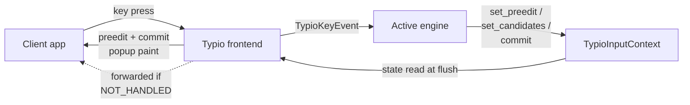
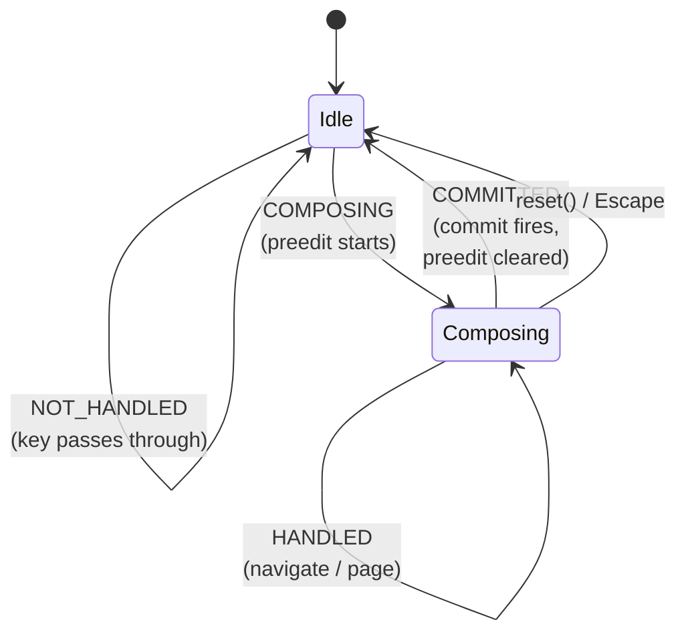
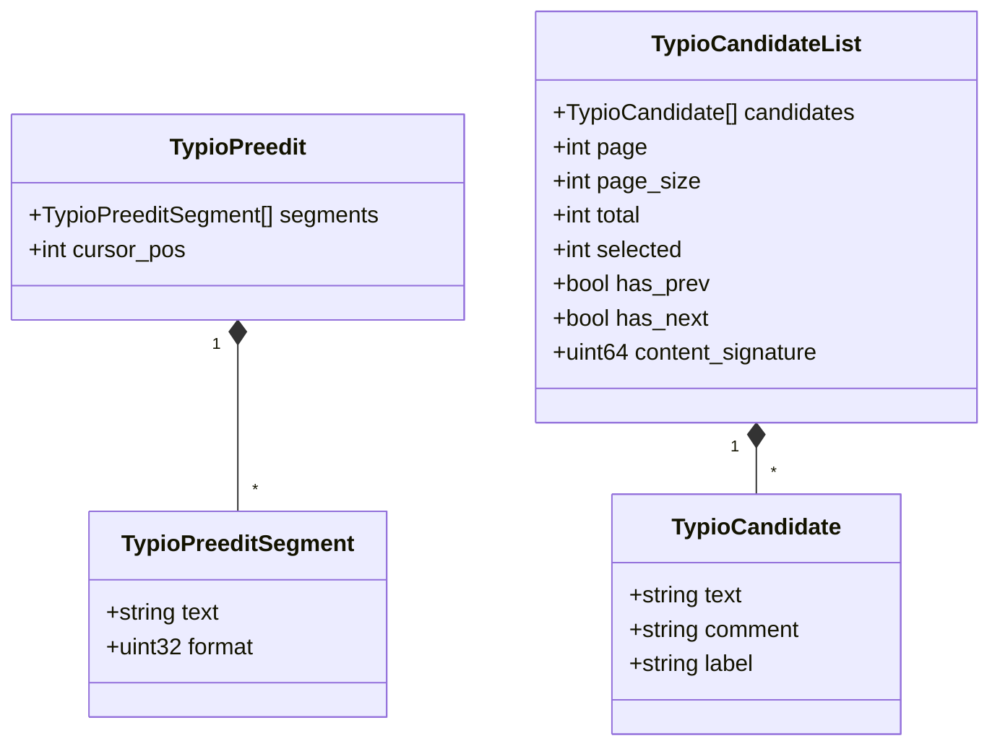
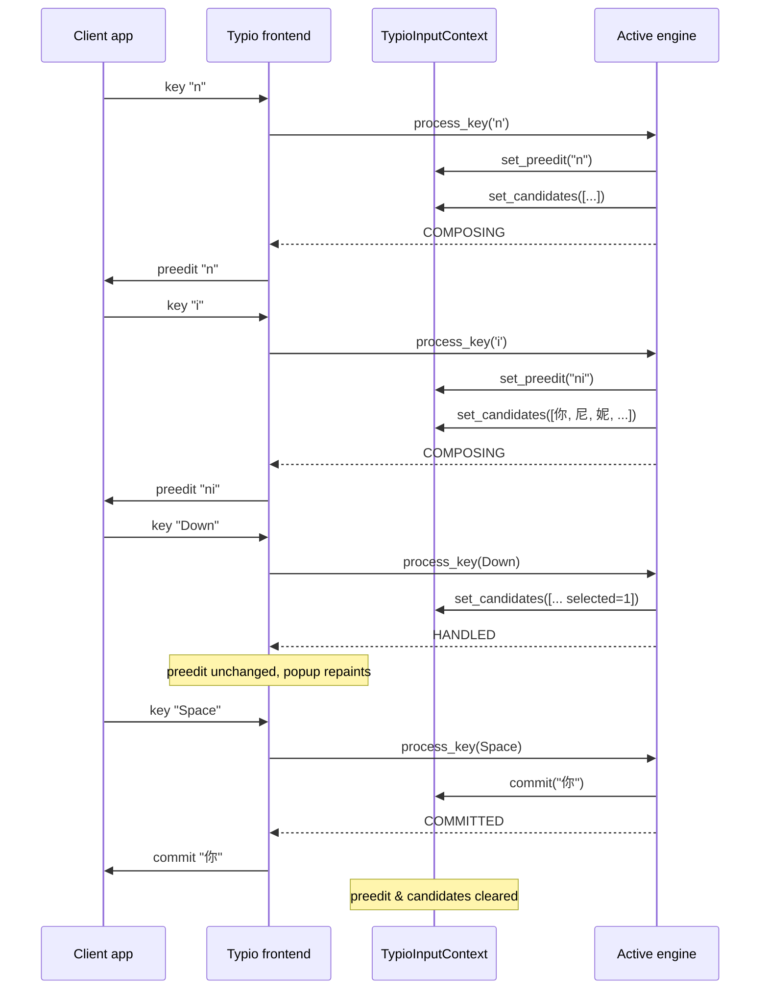
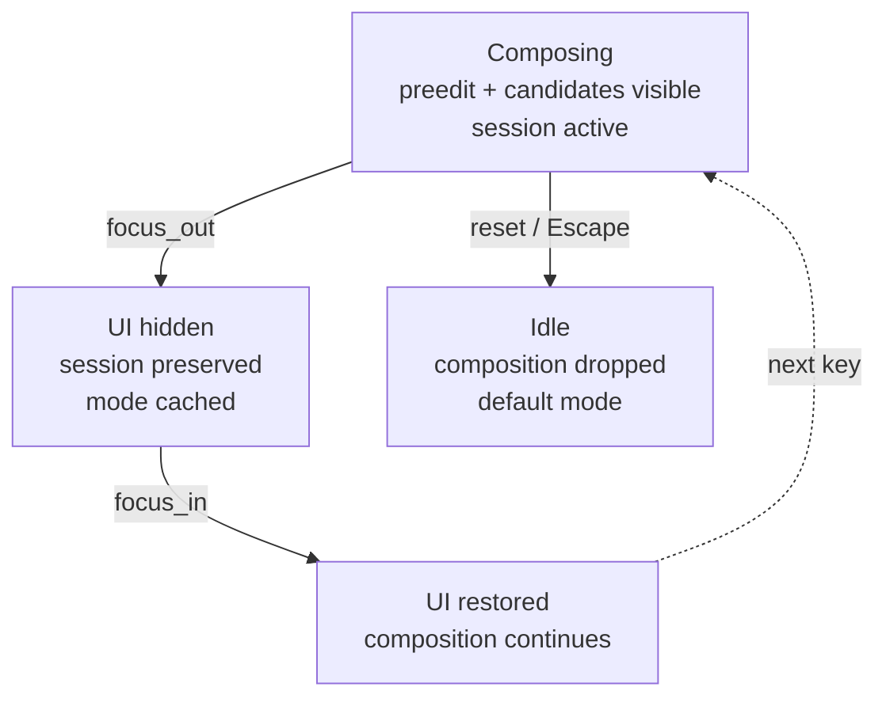

# Composition Lifecycle

How a keystroke becomes committed text — the abstract typing pipeline, independent of the Wayland protocol and any specific engine.

For the Wayland-side translation see [Architecture Overview §Wayland Data Flow](architecture-overview.md#wayland-data-flow); for grab/keymap timing see [Timing Model](timing-model.md); for a concrete worked example see [librime Integration](librime-integration.md).

## Actors

- **`TypioInputContext`** — per-focus state carrier. Holds the current preedit, the current candidate list, and per-context properties (engine sessions, mode caches). The context outlives focus churn; only its visible UI is cleared on focus loss.
- **Active engine** — the language logic. Receives key events, decides what to do, and emits preedit / candidates / commit through the context.
- **Typio frontend** — translates context updates into protocol output (preedit and commit requests to the client; popup repaint for candidates) and forwards untouched keys back to the client.

The engine is *the only* author of composition state. Typio never invents preedit text or re-orders candidates.

The solid arrows are the composition path; the dashed arrow is the passthrough path for keys the engine declines.

## The Four Key Outcomes

Every key delivered to the active engine via `process_key` returns one of four values (`include/typio/types.h`):

| Result | Meaning | Engine emits | Frontend reaction |
|---|---|---|---|
| `TYPIO_KEY_NOT_HANDLED` | Engine did not consume the key | nothing | forward the original key press/release to the client |
| `TYPIO_KEY_HANDLED` | Engine consumed it, but no committed text and no composition delta (e.g. candidate navigation, mode toggle) | possibly updated candidates / mode | swallow the key; repaint popup if state changed |
| `TYPIO_KEY_COMPOSING` | Engine consumed it and updated the in-flight composition | new preedit and/or candidates | swallow the key; refresh preedit + popup |
| `TYPIO_KEY_COMMITTED` | Engine consumed it and produced final text | committed text via `typio_input_context_commit`; preedit cleared | swallow the key; send commit; clear popup |

`HANDLED` vs `COMPOSING` is the navigation-vs-edit split: highlighting a different candidate is `HANDLED` (selection moved, preedit text is unchanged), while typing another letter that extends the syllable being composed is `COMPOSING`.

`COMMITTED` from the `Idle` state is also legal — printable keys in the built-in `basic` engine commit directly without ever entering `Composing`.

## State Shapes

The two pieces of composition state the engine owns:

**Preedit** (`TypioPreedit`) — the uncommitted text shown inline at the cursor.
- An ordered array of `TypioPreeditSegment { text, format }`; format flags are `UNDERLINE / HIGHLIGHT / BOLD / ITALIC` and may be combined.
- A `cursor_pos` in characters, used by the client to draw the caret inside the preedit.
- Updated with `typio_input_context_set_preedit`, cleared with `typio_input_context_clear_preedit`. Commit implicitly clears it.

**Candidate list** (`TypioCandidateList`) — the popup contents.
- Array of `TypioCandidate { text, comment, label }` plus `page`, `page_size`, `total`, `selected`, `has_prev`, `has_next`, and a `content_signature` that excludes the selected index.
- The `content_signature` lets the popup classify selection-only updates separately from content changes — see [Architecture Overview §Delta classification](architecture-overview.md#delta-classification).
- Updated with `typio_input_context_set_candidates`, cleared with `typio_input_context_clear_candidates`.

Commits are not state; they are a one-shot effect. `typio_input_context_commit(ctx, text)` hands a finalized UTF-8 string to the frontend, which forwards it to the client through the protocol.

## A Typical Composition

The shape is the same for any keyboard engine: one or more `COMPOSING` steps that grow the preedit and candidate set, zero or more `HANDLED` steps that move selection or change pages, and a terminating `COMMITTED` step (or an `Escape` that resets without committing).

## Why Coalescing Matters

The engine may emit `set_preedit` and `set_candidates` on every keystroke. The frontend does **not** repaint per emission — preedit / candidate callbacks set a `popup_update_pending` flag and the actual render happens once per event-loop iteration. Auto-repeat bursts collapse into a single popup paint, and selection-only updates skip the application-side preedit round-trip entirely.

This is what lets engines treat sync as straightforward: rebuild the full preedit + candidate list each time, return `COMPOSING` / `HANDLED`, and let the coalescing layer downstream drop the redundant work.

## Focus, Reset, and Sessions

Three lifecycle hooks change composition state without a key:

- **`focus_in`** — the input context just became focused. The engine should restore any visible UI that `focus_out` hid (re-emit preedit, re-emit candidates).
- **`focus_out`** — the input context lost focus. The engine should clear *visible* UI but keep *session* state — runtime options like `ascii_mode`, the librime session id, half-typed pinyin — so the next `focus_in` resumes seamlessly.
- **`reset`** — the user asked for a hard cancel (typically `Escape` with an active composition). The engine should drop the composition and return to its idle mode.

The distinction is deliberate: focus churn is constant during normal use (window switching, popups, menus) and must not lose the user's in-flight syllable. Only explicit `reset` or commit ends a composition.

Focus loss is reversible; `reset` is not.

Engines store per-context session state via `typio_input_context_set_property` / `_get_property`. The property is keyed by engine name and survives focus loss because the `TypioInputContext` itself outlives focus — the engine reuses the same session across `focus_out` → `focus_in` round-trips.

## Engine vs. Typio Authority

Within this lifecycle the split is:

- **Engine owns** — what the preedit reads, which candidates exist, what ordering they have, which one is selected, when a commit fires, and what its text is.
- **Typio owns** — when the popup paints, how candidates are laid out, how preedit is delivered to the client, and how `NOT_HANDLED` keys are forwarded.

An engine that wants different candidate ordering edits its own logic; it never asks Typio to reorder. Typio that wants smoother painting edits the popup pipeline; it never rewrites engine output. See [Architecture Overview §IME / Engine Boundary](architecture-overview.md#ime--engine-boundary) for the full ownership rules.

## Built-In `basic` vs. Plugin Engines

The built-in `basic` engine (`src/engines/basic/basic.c`) only ever returns `NOT_HANDLED` or `COMMITTED`: printable Unicode keys are committed directly with no preedit and no candidates. It is the minimum useful keyboard engine and a reference for what *not* using composition looks like.

The `librime` plugin uses every stage — preedit, multi-page candidates, mode switching, deferred deployment. The [librime Integration §5.2 Processing Flow](librime-integration.md#52-processing-flow-typio_rime_process_key) shows the concrete steps an engine performs inside a single `process_key`.

## See Also

- [Architecture Overview](architecture-overview.md) — components and protocol stack
- [Timing Model](timing-model.md) — activation phases and keyboard-grab state machine
- [Engine API Reference](../reference/api/engine.md) — full signatures for `TypioEngineBaseOps`, `TypioKeyboardEngineOps`, and the input-context emit functions
- [How to Create a Custom Engine](../how-to/create-custom-engine.md) — applying this lifecycle in a new plugin
